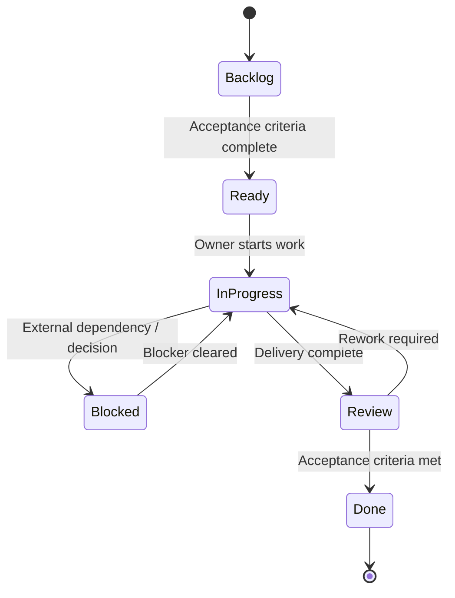

# Jira & Agile Operations Architecture Kit

A reusable governance kit for **Jira-based project delivery, PMO coordination and Agile operations**. It demonstrates how Jira can be configured as an operating system for work rather than just a ticket list.

> Synthetic portfolio assets only. No live employer configuration or confidential Jira export is included.

## Business problem

Cross-functional teams often struggle with inconsistent issue types, unclear workflow ownership, weak blocker escalation and dashboards that show activity rather than delivery health.

This kit establishes a lightweight governance standard for:

- work item taxonomy
- workflow states and transition controls
- blocker and dependency escalation
- sprint health queries
- user story / acceptance criteria quality
- automation rules
- Definition of Done and review cadence

## Repository structure

```text
jql/                 Reusable JQL library
workflows/           Workflow definitions and Mermaid diagrams
automation-rules/    Jira automation logic blueprints
templates/           User stories, sprint review and Definition of Done
docs/                Governance and field schema guidance
```

## Example JQL

**Critical blockers not updated in 24 hours**

```jql
project in (OPS, ERP, DATA)
AND statusCategory != Done
AND priority in (Highest, High)
AND labels = blocker
AND updated <= -24h
ORDER BY priority DESC, updated ASC
```

**Cross-workstream dependencies due in 7 days**

```jql
issuetype = Dependency
AND statusCategory != Done
AND due <= 7d
AND due >= startOfDay()
ORDER BY due ASC
```

## Governance model



## What this demonstrates

- JQL and filter design
- custom issue taxonomy
- workflow governance
- dependency management
- blocker escalation
- Agile artifact quality
- automation rule design
- dashboard-oriented data thinking
- operational ownership and closure discipline
