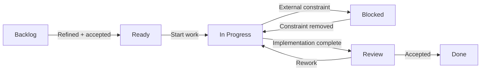

# Delivery Workflow

## Transition controls

| Transition | Required condition |
|---|---|
| Backlog → Ready | owner, priority and acceptance criteria present |
| Ready → In Progress | assignee present |
| In Progress → Blocked | blocker reason + blocker owner + next review date |
| In Progress → Review | implementation notes or linked deliverable present |
| Review → Done | acceptance criteria satisfied |
